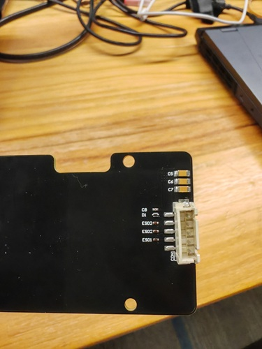

# <font size=3>一、 工程介绍</font>

```bash
create_at：2025/09/09
hardware：STM32F103RET6最小系统板、基于AIP33236的灯板
software：RT-Thread
```
<font size=2>```AIP33236 driver```是一款基于 IIC 的灯板驱动软件包，基于 RT-Thread SPI框架 设计。通过 IIC 接口控制两片 AIP33236 芯片输出特定的PWM信号来控制灯板上的RGB灯实现流畅、稳定的多彩灯效展示。</font>

## <font size=2>1. RGB灯板接口说明</font>
<font size=2>为快速验证RGB灯板的可用性,节省焊接成本，本次RGB灯带板的主控板使用自制的STM32F103RET6最小单片机系统板，RGB板为外置的PCB灯板，板上预留IIC引脚接口，以及VDD和GND接口。</font></br>




</br>


